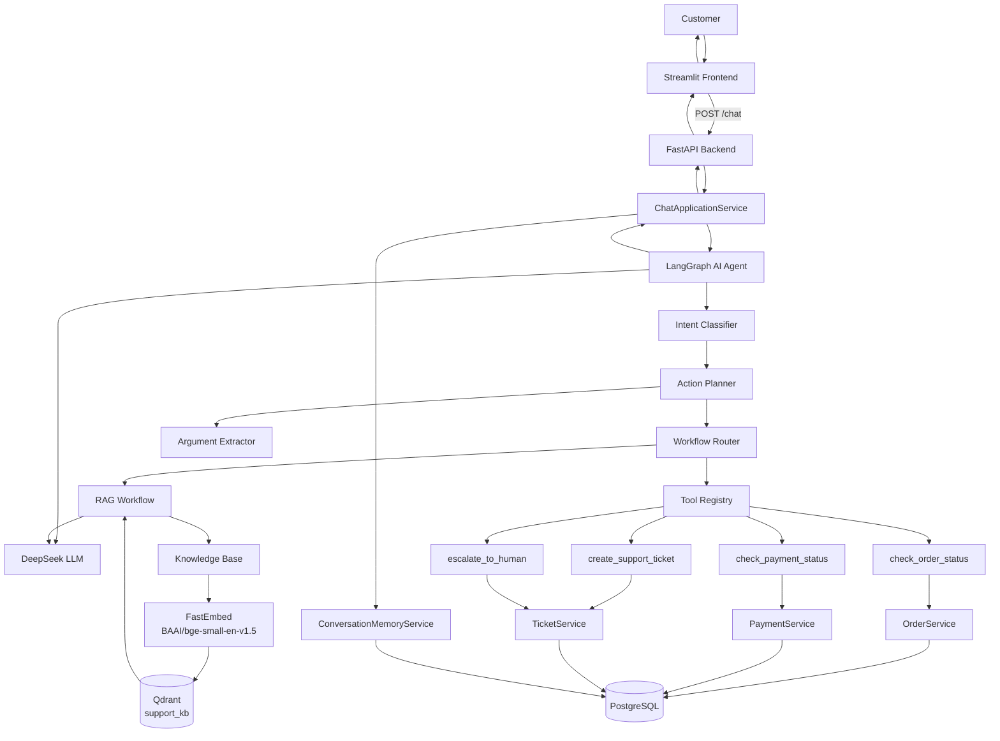
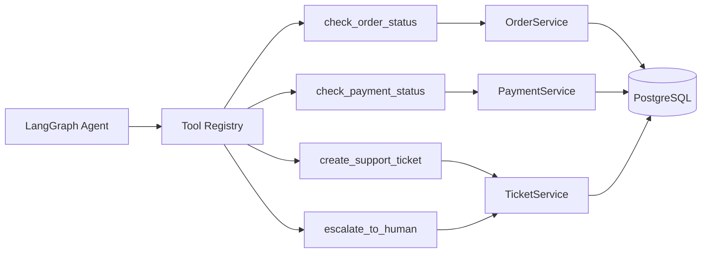
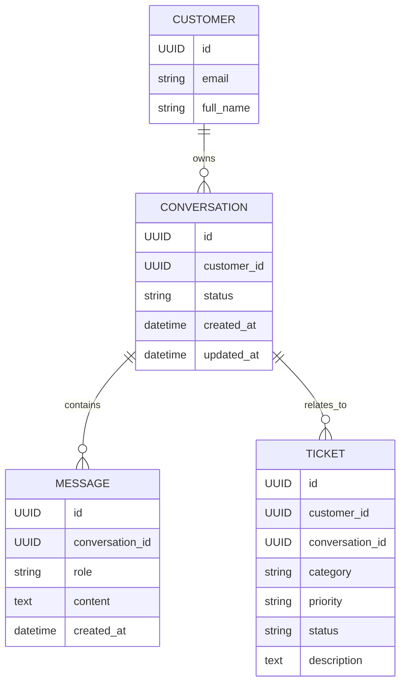
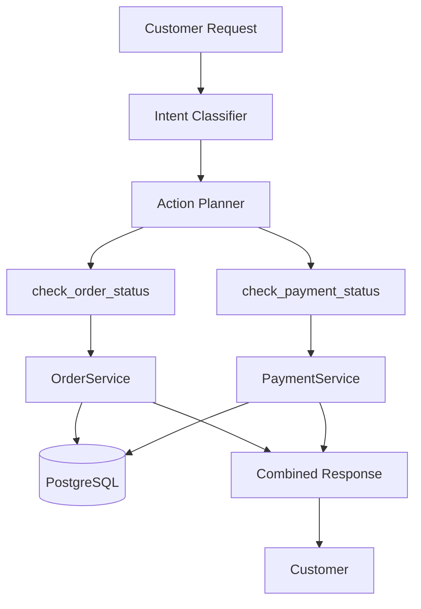
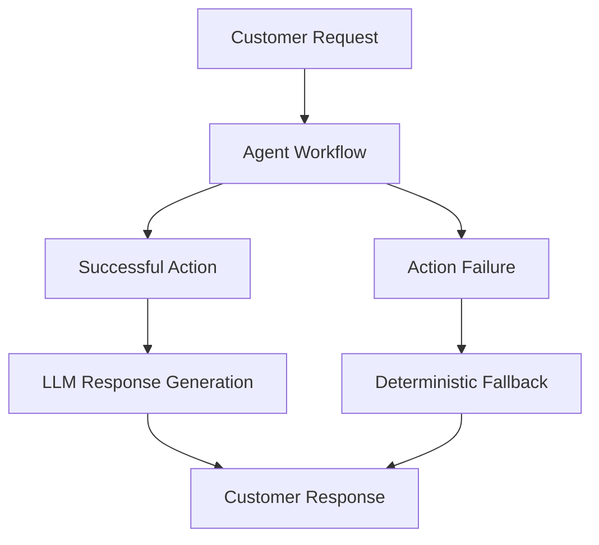
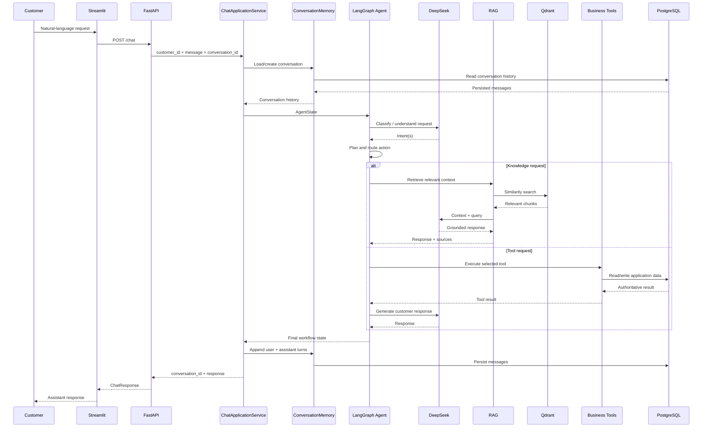

# System Architecture

## AI Customer Support & Ticket Automation System

This document describes the major components and information flow of the application.

## 1. High-Level Architecture



---

## 2. Component Responsibilities

### Customer

The customer interacts with the system through natural-language chat.

Typical requests include:

- Knowledge-base questions
- Order-status questions
- Payment-status questions
- Refund and cancellation questions
- Support-ticket requests
- Human escalation
- Follow-up questions

### Streamlit Frontend

The Streamlit application is responsible for:

- Customer-facing chat UI
- Session state
- Conversation ID handling
- Rendering user and assistant messages
- Sending requests to `POST /chat`
- Loading persisted conversation history
- Starting a new conversation
- Displaying API errors

The frontend does not contain:

- LLM logic
- RAG logic
- LangGraph logic
- Database access
- Business rules
- Tool execution

### FastAPI Backend

FastAPI exposes the application API and connects the customer-facing UI to the application services.

Primary customer-facing endpoint:

```text
POST /chat
```

Conversation-history endpoints:

```text
GET /conversations
GET /conversations/{conversation_id}
```

Additional backend endpoints support tickets, orders, payments, and escalation.

### ChatApplicationService

`ChatApplicationService` orchestrates one complete customer chat request.

It:

1. Validates the incoming message.
2. Creates or loads the customer's conversation.
3. Loads persisted conversation history.
4. Builds the initial `AgentState`.
5. Invokes the LangGraph agent.
6. Validates the generated response.
7. Persists the user and assistant turns.
8. Returns the conversation ID and response.

### LangGraph AI Agent

The agent controls the workflow for the current customer request.

The workflow includes:

- Intent classification
- Action planning
- Workflow routing
- Argument extraction
- RAG execution
- Tool execution
- Clarification
- Multi-tool execution
- Mixed RAG + tool workflows
- Response generation
- Finalization

### Intent Classifier

The intent classifier identifies one or more customer intents.

Supported intents:

```text
KNOWLEDGE_QUERY
ORDER_STATUS
PAYMENT_STATUS
REFUND
CANCELLATION
SUPPORT_TICKET
HUMAN_ESCALATION
UNKNOWN
```

### Action Planner

The planner converts classified intents into explicit actions.

Examples:

```text
ORDER_STATUS
    ↓
TOOL → check_order_status
```

```text
KNOWLEDGE_QUERY
    ↓
RAG
```

```text
ORDER_STATUS + PAYMENT_STATUS
    ↓
TOOL → check_order_status
TOOL → check_payment_status
```

The planner is authoritative for downstream workflow selection.

### RAG Pipeline

RAG handles company-specific knowledge questions.

Pipeline:

```text
Knowledge Base
      ↓
Document Loading
      ↓
Normalization
      ↓
Chunking
      ↓
Embedding
      ↓
Qdrant
      ↓
Similarity Retrieval
      ↓
Relevant Context
      ↓
DeepSeek
      ↓
Grounded Response
```

### Knowledge Base

The knowledge base contains:

```text
faq.md
product_information.md
refund_policy.md
cancellation_policy.md
shipping_policy.md
payment_policy.md
account_policy.md
support_guidelines.md
```

### Embedding Service

The application uses:

```text
BAAI/bge-small-en-v1.5
```

with:

```text
Vector dimension = 384
```

### Qdrant

Qdrant stores the knowledge-base embeddings.

Configured collection:

```text
support_kb
```

Similarity:

```text
Cosine
```

### DeepSeek LLM

DeepSeek is used for language-model responsibilities such as:

- Intent classification
- Structured argument extraction
- Grounded response generation
- Tool-result response generation
- Combined multi-action response generation

The application remains responsible for business truth and transactional operations.

---

## 3. Business Tool Architecture

The business tools are registered through a central tool registry.



### Order Tool

`check_order_status` retrieves authoritative order information through `OrderService`.

The workflow validates the customer relationship before exposing order data.

### Payment Tool

`check_payment_status` resolves the customer's order and retrieves the latest payment through `PaymentService`.

### Ticket Tool

`create_support_ticket` creates a support ticket through `TicketService`.

### Escalation Tool

`escalate_to_human` creates an urgent support ticket for human intervention.

---

## 4. Conversation Memory Architecture

Conversation state is persisted in PostgreSQL.



### Memory Lifecycle

```text
Customer Request
      ↓
Conversation ID supplied?
      ├── No  → Create Conversation
      └── Yes → Load Owned Conversation
      ↓
Load Previous Messages
      ↓
Agent receives conversation history
      ↓
Generate response
      ↓
Persist:
  user message
  assistant response
      ↓
Return conversation ID
```

This enables follow-up requests such as:

```text
Customer:
My order number is 45821.

Later:
When will it arrive?
```

The existing conversation context allows the backend to resolve the reference to the previously discussed order.

---

## 5. Multi-Intent Workflow

The system supports multiple requests in one customer message.

Example:

```text
Please check my order 45821 status and tell me whether the payment was successful.
```

Workflow:



The system preserves planned action order and retains successful results when another action fails.

---

## 6. Mixed RAG + Tool Workflow

The planner can also produce a mixed workflow.

Conceptually:

```text
Customer Request
      ↓
Intent Classification
      ↓
Action Planner
      ↓
┌─────────────────────────┐
│ TOOL action              │
│ RAG action               │
└─────────────────────────┘
      ↓
Execute actions
      ↓
Collect successful and failed results
      ↓
Generate coherent response
```

This allows a complex customer issue to combine authoritative transactional information with company-policy knowledge.

---

## 7. Error Handling Flow

The application uses deterministic fallback handling for failures.



Failure classes include:

- Invalid input
- Missing information
- Invalid order ID
- Invalid tool parameters
- Tool failure
- Retrieval failure
- LLM failure
- Ticket creation failure
- Empty knowledge-base results

The system avoids inventing transactional information when authoritative data is unavailable.

---

## 8. Data Ownership and Security Boundary

The application deliberately separates AI reasoning from business truth.

```text
                 AI Layer
    ┌───────────────────────────────┐
    │ Intent understanding          │
    │ Action planning               │
    │ Argument extraction           │
    │ Natural-language generation   │
    └───────────────┬───────────────┘
                    │
                    ↓
             Application Layer
    ┌───────────────────────────────┐
    │ Validation                     │
    │ Authorization / ownership      │
    │ Business rules                 │
    │ Database operations            │
    │ Tool execution                 │
    │ Persistence                    │
    │ Error handling                 │
    └───────────────────────────────┘
```

For example, the order ID alone is not treated as authorization to access an order. Customer ownership is checked by the application service/tool layer.

---

## 9. End-to-End Request Flow



---

## 10. Runtime Boundaries

### Frontend

```text
frontend/streamlit/
├── app.py
├── api_client.py
└── config.py
```

### Backend

```text
app/
├── api/
├── services/
├── ai/
└── db/
```

### Infrastructure

```text
PostgreSQL
Qdrant
```

The frontend communicates with the backend through HTTP APIs and does not access PostgreSQL or Qdrant directly.

---

## 11. Deployment / Development Topology

```text
Developer Machine
│
├── Streamlit
│     └── Customer UI
│
├── FastAPI
│     └── Agent application
│
├── PostgreSQL
│     └── Application data + conversation memory
│
└── Qdrant
      └── Knowledge-base vectors
```

Development infrastructure is started using Docker Compose.

---

## 12. Architectural Principles

### 1. Separation of Concerns

Each layer has a clear responsibility.

```text
UI
 ↓
API
 ↓
Application Service
 ↓
Agent
 ↓
RAG / Tools
 ↓
Repositories / Database
```

### 2. LLM Is Not the Source of Truth

Transactional data such as order and payment state comes from application services and PostgreSQL.

### 3. Planner-Driven Workflow

The action planner determines downstream execution instead of independently remapping the same intent inside multiple nodes.

### 4. Customer Ownership

Business tools validate customer ownership before exposing customer-specific data.

### 5. Persistent Memory

Conversation messages are stored in PostgreSQL so context survives individual frontend requests.

### 6. Failure Isolation

RAG, tools, LLM generation, and ticket operations have explicit failure handling and customer-safe fallbacks.

### 7. Single Customer Interaction Surface

The Streamlit UI exposes a natural-language chat interface rather than separate buttons for order lookup, payment lookup, ticket creation, or escalation.

---

## 13. Current Customer Experience

```text
Customer
   ↓
Streamlit chat
   ↓
Natural-language request
   ↓
AI Agent
   ├── Answer using RAG
   ├── Call business tool
   ├── Execute multiple tools
   ├── Combine RAG + tools
   ├── Ask clarification
   ├── Create ticket
   └── Escalate to human
   ↓
Persist conversation
   ↓
Customer response
```

The customer does not need to know which internal component handled the request.
